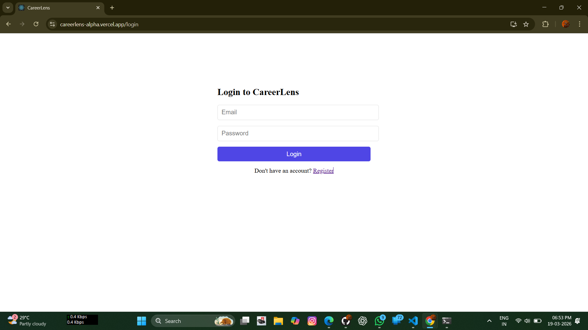
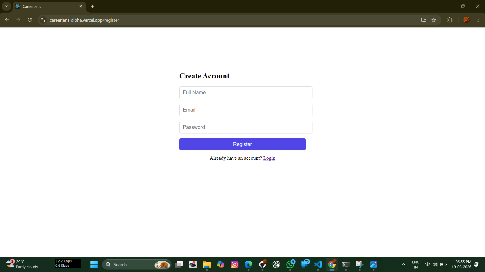
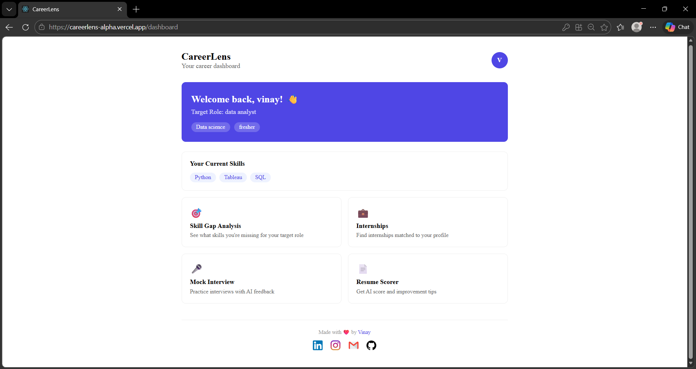
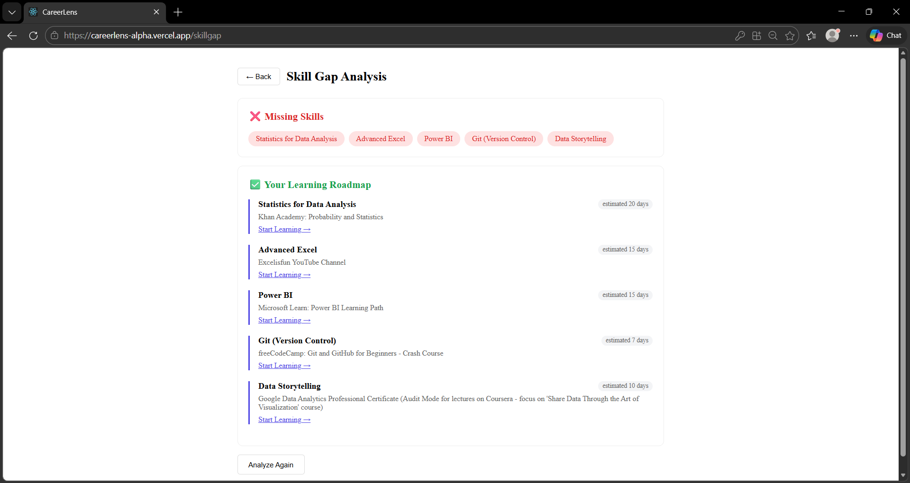
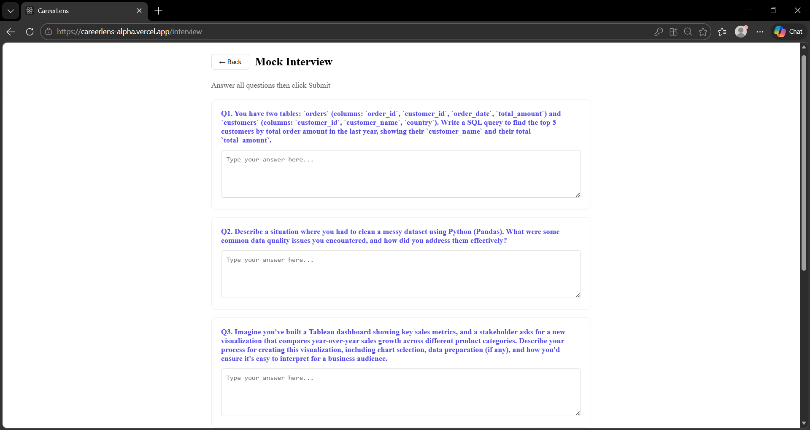
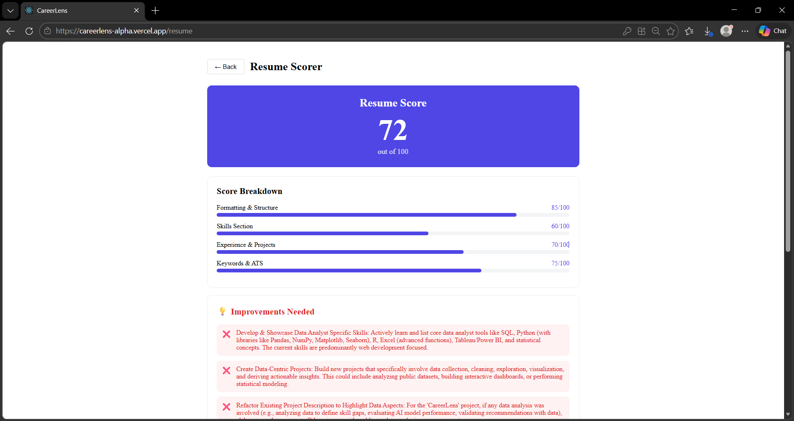

# CareerLens 🎓
### AI-Powered Career Readiness Platform for College Students

🌐 **Live Demo:** [careerlens-alpha.vercel.app](https://careerlens-alpha.vercel.app)

---

## 🚀 About The Project

Most college students in India have no idea what skills they're missing for their target job, what internships suit them, or how to prepare for interviews. Career counselling is expensive, college placement cells are generic, and existing platforms don't tell you what to do next.

**CareerLens solves exactly that.**

---

## ✨ Features

- 🎯 **AI Skill Gap Analysis** — Compares your current skills with your target role and shows exactly what's missing
- 🗺️ **Personalized Learning Roadmap** — AI generates a step-by-step roadmap with free resources
- 💼 **Internship Feed** — Shows internships matched to your skills and target role
- 🎤 **AI Mock Interview** — Asks real interview questions and evaluates your answers with scores
- 📄 **Resume Scorer** — Scores your resume out of 100 with specific improvement tips
- 📊 **Student Dashboard** — Track your progress and manage your career journey

---

## 🛠️ Built With

- **Frontend** — React.js, React Router, Axios
- **Backend** — Node.js, Express.js
- **Database** — MongoDB, Mongoose
- **AI** — Google Gemini API
- **Authentication** — JWT, bcrypt
- **Deployment** — Vercel (frontend), Render (backend), MongoDB Atlas (database)

---

## 📸 Screenshots








---

## 🏃 Running Locally

### Prerequisites
- Node.js
- MongoDB
- Git

### Installation

**1. Clone the repository**
```bash
git clone https://github.com/SWARGAMVINAY/careerlens.git
cd careerlens
```

**2. Setup Backend**
```bash
cd server
npm install
```

Create a `.env` file in the server folder:
```
PORT=5000
MONGO_URI=mongodb://localhost:27017/careerlens
JWT_SECRET=your_jwt_secret
GEMINI_API_KEY=your_gemini_api_key
```

Start the server:
```bash
npm run dev
```

**3. Setup Frontend**
```bash
cd client
npm install
npm start
```

**4. Open your browser**
```
http://localhost:3000
```

---

## 🌐 Deployment

- Frontend deployed on **Vercel**
- Backend deployed on **Render**
- Database hosted on **MongoDB Atlas**

---

## 👨‍💻 Developer

**Vinay Swargam**

[](https://linkedin.com/in/vinayswargam6716)
[](https://github.com/SWARGAMVINAY)
[](mailto:vinayswargam17@gmail.com)

---

## 📝 License

This project is open source and available under the [MIT License](LICENSE).

---

⭐ If you found this project useful, please give it a star on GitHub!
```
 